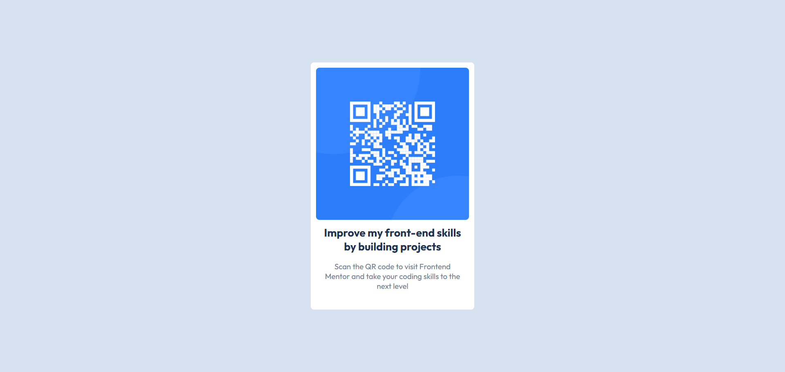
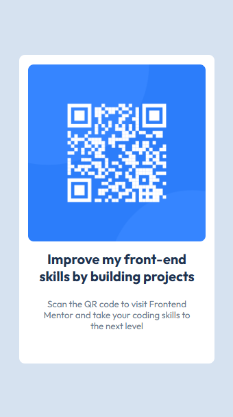

# QR Code Component - Frontend Mentor Challenge

The project is a single web page with a centered QR code card.
    
This project is a challenge from the Frontend Mentor website, a platform where developers can practice and improve their skills by building web applications based on provided designs. Although the project was originally intended to be built using HTML5 and CSS3, I chose to implement it using React in order to further develop my React.js skills. <a href="https://www.frontendmentor.io/challenges/qr-code-component-iux_sIO_H">Click here</a> to access the challenge page.

## Live Preview

[View Live Project](https://qr-code-component-neon-zeta.vercel.app/)

## Screenshots

### Desktop

    

### Mobile

    

## Features

- Responsive layout for mobile and desktop
- Centered QR code card design
- Built with reusable React components
- Clean and minimal UI

## What I learned

- How to structure a small React project
- How to create a reusable React component
- Styling a React component and the App.jsx
- Improving layout responsiveness with CSS3

## Skills

- HTML5
- CSS3
- JavaScript
- React.js

## Support

If you have any questions or suggestions about this project, feel free to contact me through my GitHub profile or email <a href="mailto:developer.wesllen@gmail.com">developer.wesllen@gmail.com</a>.

## Authors

- [@WesllenCarmo](https://www.github.com/WesllenCarmo) - Web Developer

